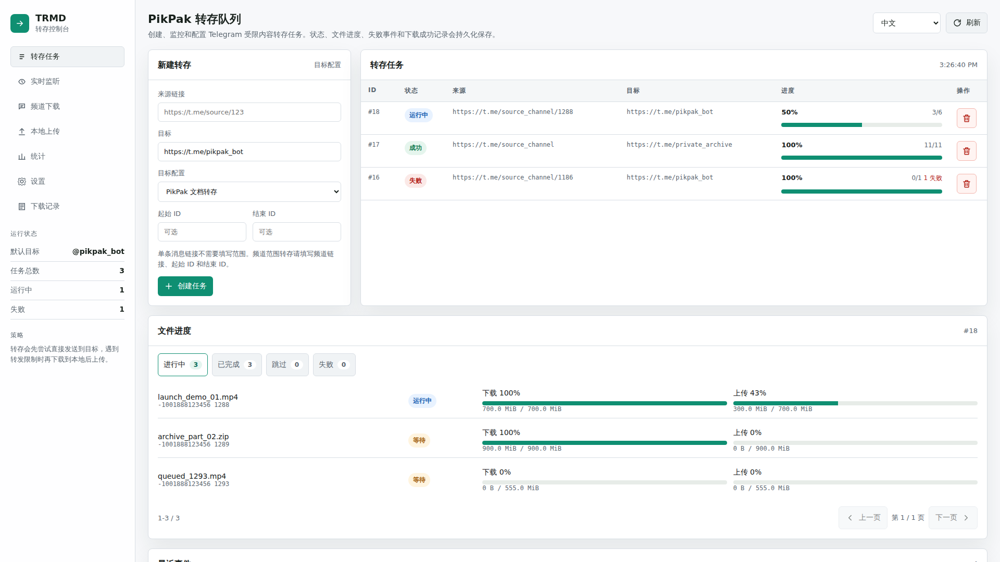
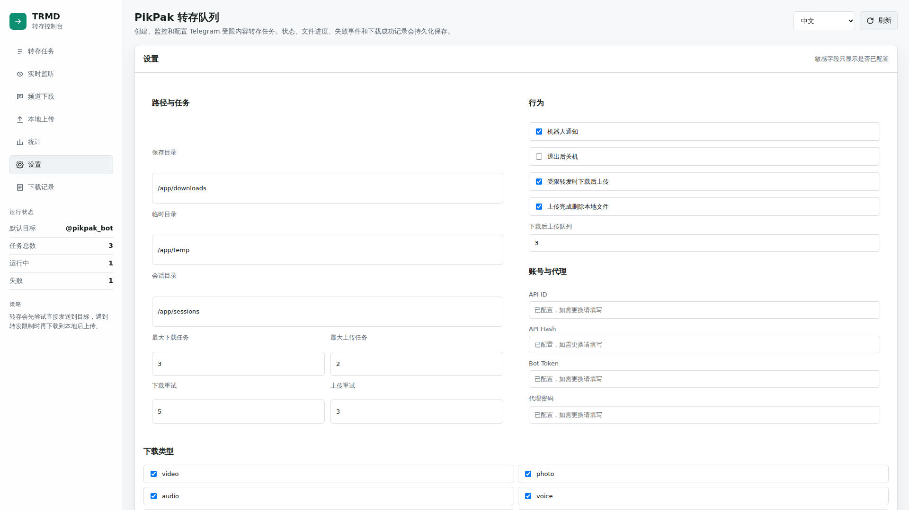

# Telegram Restricted Media Downloader WebUI Fork

这是基于 [Gentlesprite/Telegram_Restricted_Media_Downloader](https://github.com/Gentlesprite/Telegram_Restricted_Media_Downloader) 的大改版分支。这个分支不再把浏览器入口当成终端包装器，而是把 TRMD 改成一个面向长期运行的 Docker + WebUI 转存控制台。

本项目只应被用于你有权访问、保存和转存的 Telegram 内容。使用者需要自行承担使用行为及其后果，项目作者不对任何违规用途负责。

## 界面预览





## 相比原 fork 的主要改动

本分支的改动是直接替换式改造，不追求兼容旧的 Web 终端入口。

| 方向 | 原项目 / 上游做法 | 本分支做法 |
| --- | --- | --- |
| 浏览器入口 | `ttyd` / 终端式 Web 入口 | 原生可视化 WebUI，创建、查看、删除转存任务 |
| 部署方式 | Windows / Linux 二进制和 Docker 并存 | 以 Docker 部署为主，镜像发布到 GHCR |
| 任务状态 | 主要依赖运行时队列和终端输出 | SQLite 持久化 Transfer Task、Transfer Item、事件和下载成功记录 |
| 远程访问 | Web 入口认证不够明确 | 对外监听时必须配置 `TRMD_WEB_USERNAME` 和 `TRMD_WEB_PASSWORD` |
| PikPak 转存 | 以机器人命令/终端操作为主 | WebUI 默认目标为 `https://t.me/pikpak_bot`，支持 PikPak 文档转存配置 |
| 稳定性 | 长任务进度不易恢复观察 | 支持断点续传进度展示、FloodWait 等待后恢复、下载成功记录复用 |
| 运维体验 | 日志和终端交互为主 | WebUI 管理转存、实时监听、频道下载、本地上传、统计表和设置 |

当前分支在上游 `v2.0.0` 之后加入了这些核心模块：

- `module/web_ui.py` / `module/web_ui_assets.py`：可视化 WebUI 和 API。
- `module/transfer_store.py`：SQLite 任务、文件进度、事件、下载成功记录。
- `docker-compose.yml`：默认的 Docker Compose 部署模板。
- `.github/workflows/release_docker.yml`：GHCR Docker 镜像发布。
- `docs/adr/`：关键架构决策，包括替换 ttyd、SQLite 持久化和 WebUI 鉴权。

## 功能概览

- 在浏览器中创建单条消息转存任务。
- 对频道链接指定起始 ID / 结束 ID，批量创建转存任务。
- 默认支持转存到 PikPak bot，也可以改成普通 Telegram 目标。
- 转发受限时自动走下载到本地再上传的 fallback 路径。
- 展示任务进度、文件下载/上传进度、最近事件和失败信息。
- WebUI 中管理实时监听、频道下载、本地上传、下载成功记录和统计表导出。
- WebUI 设置页可以修改常用运行配置，敏感字段只显示是否已配置，不回显明文。
- Docker 挂载配置、会话、下载、临时文件和统计表目录，容器重启后保留状态。

## Docker 部署

推荐使用 Docker Compose。下面的配置与仓库内 [docker-compose.yml](docker-compose.yml) 一致。

```yaml
services:
  trmd:
    image: ghcr.io/asheblog/telegram_restricted_media_downloader:latest
    container_name: trmd
    restart: unless-stopped
    stdin_open: true
    tty: true
    ports:
      - "2921:2921"
    volumes:
      - ./config:/app/TRMD
      - ./sessions:/app/sessions
      - ./downloads:/app/downloads
      - ./temp:/app/temp
      - ./form:/app/form
    environment:
      - TZ=Asia/Shanghai
      - TRMD_WEB_HOST=0.0.0.0
      - TRMD_WEB_USERNAME=admin
      - TRMD_WEB_PASSWORD=change-this-password
    command:
      - python
      - main.py
      - --config
      - /app/TRMD/config.yaml
      - --web
      - "2921"
      - --mode
      - SESSION
```

启动：

```bash
docker compose up -d
```

查看日志：

```bash
docker logs -f trmd
```

打开 WebUI：

```text
http://服务器IP:2921
```

登录账号密码来自 Compose 里的：

```env
TRMD_WEB_USERNAME=admin
TRMD_WEB_PASSWORD=change-this-password
```

部署到公网或反代后，务必把默认密码改成强密码。程序绑定 `TRMD_WEB_HOST=0.0.0.0` 时，如果没有同时设置用户名和密码，会拒绝启动，避免 WebUI 裸露。

## 首次初始化

首次启动时，容器会在 `./config/config.yaml` 生成用户配置。你需要准备 Telegram API 信息：

1. 打开 `https://my.telegram.org/auth`。
2. 使用自己的 Telegram 手机号登录。
3. 进入 `API development tools`。
4. 记录 `api_id` 和 `api_hash`。

可以通过两种方式完成配置。

### 方式一：看日志交互配置

容器保留了 `stdin_open` 和 `tty`，可以进入容器按提示填写：

```bash
docker attach trmd
```

填写完成后按提示保存配置。退出 attach 时使用 Docker 的 detach 快捷键 `Ctrl-p` 然后 `Ctrl-q`，不要用 `Ctrl+C` 中断容器进程；更稳妥的做法是先让配置生成出来，再编辑配置文件。

### 方式二：直接编辑配置文件

编辑 `./config/config.yaml`，至少确认这些字段：

```yaml
api_id: "123456"
api_hash: "xxxxxxxxxxxxxxxxxxxxxxxxxxxxxxxx"
bot_token: null
download_type:
  - video
  - photo
  - document
  - audio
  - voice
  - animation
  - video_note
is_shutdown: false
links: null
max_tasks:
  download: 1
  upload: 3
max_retries:
  download: 5
  upload: 3
target_profiles:
  pikpak:
    max_file_size: 4294967296
proxy:
  enable_proxy: false
  hostname: null
  scheme: null
  port: null
  username: null
  password: null
save_directory: /app/downloads
session_directory: /app/sessions
temp_directory: /app/temp
```

保存后重启：

```bash
docker compose restart
```

第一次登录 Telegram 账号时会在 `./sessions` 保存会话文件。后续容器升级或重启不要删除 `./sessions`，否则需要重新登录。

## 目录说明

| 宿主机目录 | 容器目录 | 用途 |
| --- | --- | --- |
| `./config` | `/app/TRMD` | `config.yaml` 用户配置 |
| `./sessions` | `/app/sessions` | Telegram 登录会话 |
| `./downloads` | `/app/downloads` | 下载后的媒体文件 |
| `./temp` | `/app/temp` | 临时文件与 SQLite 转存状态 |
| `./form` | `/app/form` | 统计表导出目录 |

`transfer_tasks.sqlite3` 位于 `/app/temp` 对应的挂载目录中。保留 `./temp` 可以保留 WebUI 任务历史、文件进度、事件和下载成功记录。

## 常用命令

升级镜像：

```bash
docker compose pull
docker compose up -d
```

停止服务：

```bash
docker compose down
```

只重启服务：

```bash
docker compose restart
```

备份关键数据：

```bash
tar -czf trmd-backup.tar.gz config sessions temp form
```

Windows 环境建议在 PowerShell 或 Windows Terminal 中运行 Docker 命令；WSL 和 Linux 下命令相同。挂载路径尽量使用英文目录，避免旧 Telegram 会话库或文件移动逻辑遇到路径编码问题。

## WebUI 环境变量

| 变量 | 默认值 | 说明 |
| --- | --- | --- |
| `TRMD_WEB_HOST` | `127.0.0.1` | WebUI 监听地址；Docker 对外访问通常设为 `0.0.0.0` |
| `TRMD_WEB_USERNAME` | 空 | Basic Auth 用户名 |
| `TRMD_WEB_PASSWORD` | 空 | Basic Auth 密码 |
| `TZ` | 镜像默认时区 | 日志和容器时区 |

当 `TRMD_WEB_HOST` 是 `0.0.0.0`、公网 IP 或其他非 localhost 地址时，必须设置 `TRMD_WEB_USERNAME` 和 `TRMD_WEB_PASSWORD`。

## 使用建议

- WebUI 适合长期运行在服务器上，创建任务后让容器持续处理。
- 转存到 PikPak bot 时，目标配置选择 `PikPak 文档转存`，上传后默认可删除本地临时文件。
- 普通 Telegram 目标可以选择 `通用 Telegram 目标`。
- 频道范围任务请填写频道链接、起始 ID 和结束 ID；单条消息链接不需要填写范围。
- 遇到 FloodWait 时程序会等待并恢复进度，不要频繁重启容器。
- 如果 WebUI 看得到任务但文件没有继续走，先看 `docker logs -f trmd` 中的 Telegram 登录、代理、权限和 FloodWait 信息。

## 迁移说明

从原项目迁移到本分支时，建议按“无迁移、直接替换”处理：

1. 保留原项目中可用的 `api_id`、`api_hash`、`bot_token`、代理配置和下载类型。
2. 新建本分支的 Docker Compose 部署目录。
3. 把配置写入 `./config/config.yaml`。
4. 重新登录生成 `./sessions`，或在确认路径兼容后再迁移旧 session。
5. 旧的 ttyd、tmux、Windows/Linux 二进制发布流程不再使用。

本分支不保证兼容上游旧 Web 入口、旧运行脚本或旧目录布局。正确性和可维护性优先于兼容性。

## License

本项目继承上游 MIT License。上游作者为 [Gentlesprite](https://github.com/Gentlesprite)。
